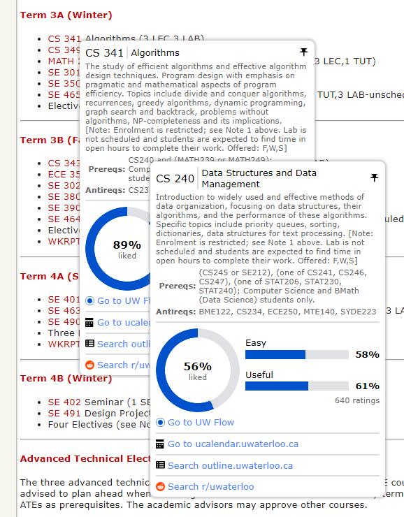

# uw-linker

Chrome extension that adds tooltips linking various University of Waterloo sites and third-party sites together. Uses vanilla HTML/CSS/JS.

## About

Course Tooltips:

- Enabled on University of Waterloo sites, UW Flow and r/uwaterloo

- Hover over a course code to open

- Displays course info, UW Flow rating and links to various sites

- Supports pinning (keep a tooltip open) and nesting (tooltips can open from other tooltips)

More types of tooltips may be added in the future.
